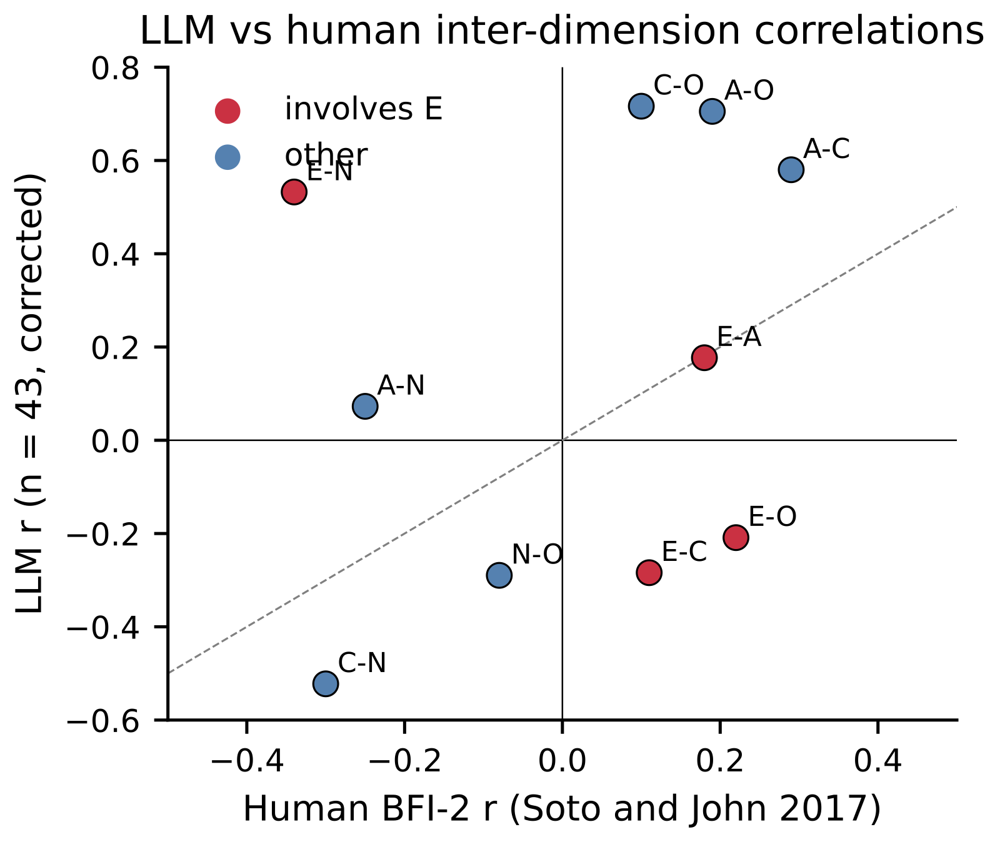
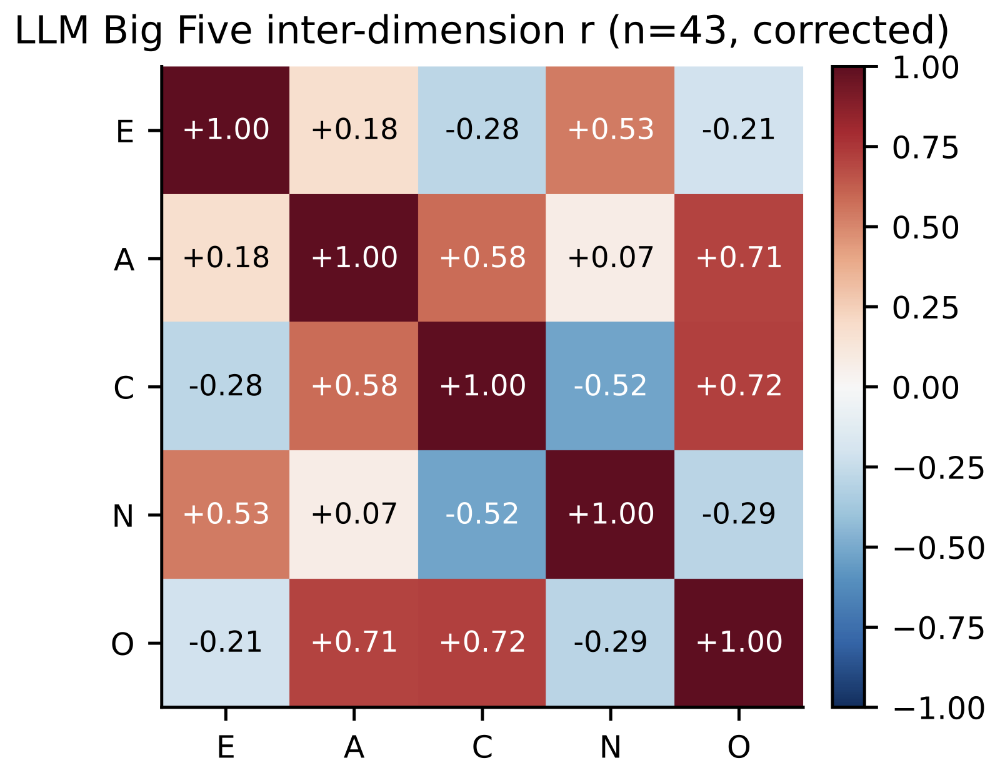
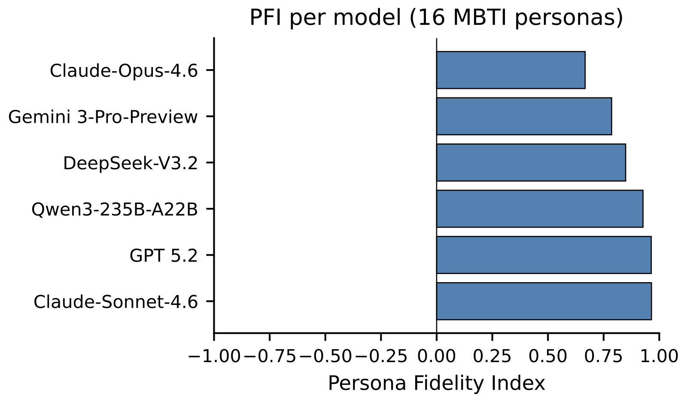
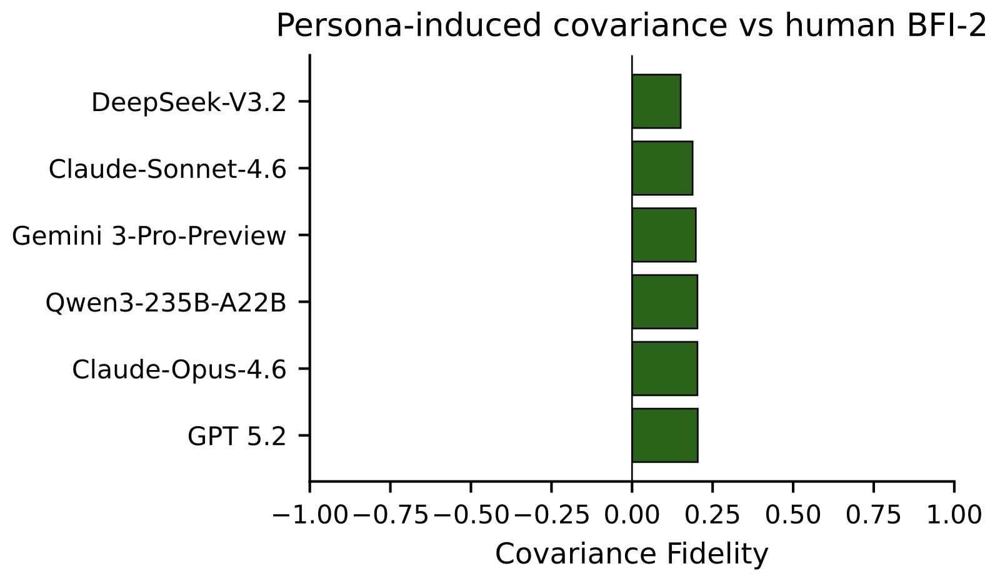
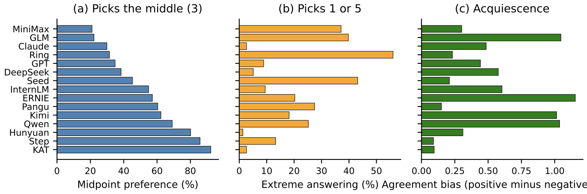

# What LLMs Really Answer on Personality Questionnaires
## A Methodological Audit and Corrected Baseline Across 46 Frontier Models

[](https://2026.emnlp.org/)
[](https://arxiv.org/)
[](#license)

---

## Abstract

Large language models are increasingly evaluated with classical personality questionnaires, yet the behavioural meaning of the resulting scores is unclear. We collect responses from **46 instruction-tuned models from 17 families** on **61 Likert items** spanning the Big Five, HEXACO Honesty-Humility, Schwartz collectivism, cognitive intuition, and Hofstede uncertainty avoidance, with **12 random seeds** per item per model. Two methodological audits frame our analysis.

**First**, we show that a common reverse-scoring implementation, used in widely cited LLM personality studies, has an off-by-one error that targets positive-keyed items rather than negative-keyed ones. Under this implementation the inter-dimension correlation matrix is silently inverted on Big Five dimensions, producing the (false) conclusion that LLMs reverse the human Conscientiousness-Neuroticism trade-off. Re-scored data from the same 46 models yields the opposite pattern: **r(C, N) = −0.52**, 95% CI [−0.71, −0.27], in the same direction as the human BFI-2 baseline (r = −0.30) and stronger.

**Second**, we run a 16-persona MBTI steering experiment on 9 frontier models. The six models with full or near-full coverage shift their mean scores in the direction predicted by classical MBTI to Big Five mappings for **67% to 98%** of the archetypes (mean Persona Fidelity 0.86), yet the cross-persona inter-dimension correlation matrix remains far from the human pattern (mean Frobenius alignment 0.19) and the default condition's strong negative C-N trade-off either weakens to near zero or remains close to the unconditioned value, never converging toward the human baseline.

After correction the real structural finding is **not** a missing C-N trade-off but a systematic **inversion of Extraversion's relationships** with Neuroticism, Conscientiousness, and Openness, paired with strong **over-correlation among Agreeableness, Conscientiousness, and Openness**.

---

## Headline Numbers

| Metric | Buggy implementation (prior literature) | Corrected (this paper) |
|---|---|---|
| Cohort size | n = 33 (15 families) | **n = 46 (17 families)** |
| C-N correlation | +0.76 (apparent flip) | **−0.52** (matches human direction) |
| E-N correlation | not reported | **+0.53** ⚡ flip |
| E-C correlation | not reported | **−0.28** ⚡ flip |
| E-O correlation | −0.51 | −0.21 (still flipped) |
| A-O correlation | not reported | **+0.71** (4× human) |
| C-O correlation | not reported | **+0.72** (7× human) |
| Median pairwise Cohen's d | 1.01 | **1.24 (Study 1) / 1.90 (n=43)** |
| Acquiescence pattern | "negative" 14/15 | **positive 15/15** (mean +0.52) |
| MBTI Persona Fidelity (6 models) | — | **+0.86** |
| MBTI Covariance Fidelity (6 models) | — | **0.19** (far from human ≈ 1.00) |

---

## Method

### Psychometric Instruments

We use **9 dimensions measured by 61 questions** on a 1-5 agreement scale:

| Dimension | Source | Items | Reverse Scored |
|------|------|---|---|
| Extraversion | BFI-44 | 8 | 4 |
| Agreeableness | BFI-44 | 9 | 4 |
| Conscientiousness | BFI-44 | 9 | 4 |
| Neuroticism | BFI-44 | 8 | 1 |
| Openness | BFI-44 | 10 | 3 |
| HEXACO Honesty-Humility | HEXACO-PI-R subset | 5 | all (high score = ethical) |
| Collectivism | Schwartz Values | 4 | 2 |
| Intuition | Cognitive style | 4 | 2 |
| Uncertainty Avoidance | Hofstede | 4 | 2 |

Each dimension score is the average of its items after reverse-scoring negative-keyed items.

> ⚠️ **Critical**: The off-by-one bug we document targeted POSITIVE-keyed items rather than negative-keyed ones, silently flipping E, C, and O completely; partially flipping A; and corrupting N. See [Appendix L: Reverse-Scoring Audit](paper/emnlp2026_improved.pdf) and [docs/CRITICAL_BUG_REPORT.md](docs/CRITICAL_BUG_REPORT.md) for full details.

### Models

**Three nested cohorts (46 models, 17 families)**:

#### Primary cohort (15 flagship models)
1 representative per family, the most capable model available at each provider.

#### Within-family cohort (18 additional models)
Qwen, DeepSeek, and Zhipu version ladders for cross-generational comparison.

#### Frontier replication cohort (13 models, 2026-04)
| # | Family | Model |
|---|------|-------|
| 1 | Anthropic | Claude-Opus-4.6 |
| 2 | Anthropic | Claude-Sonnet-4.6 |
| 3 | OpenAI | GPT 5.2 |
| 4 | OpenAI | GPT 5.4 (excluded — gateway 404) |
| 5 | Google | Gemini 3-Pro-Preview |
| 6 | Google | Gemini-3-Flash-Preview |
| 7 | DeepSeek | DeepSeek-V3.2 |
| 8 | Qwen | Qwen3-235B-A22B |
| 9 | ByteDance | Doubao-Seed-1.6 (excluded — gateway 404) |
| 10 | Zhipu | GLM-4.7 |
| 11 | Zhipu | GLM-5.1 |
| 12 | Moonshot | Kimi-K2.5 |
| 13 | MiniMax | MiniMax-M2.7 |

### Protocol

- 61 items × 12 seeds × per model = ~10,980 calls per model under default prompt
- Total **2,800+ records** (Studies 1+2+6) after rescoring
- Temperature 0.7, single-API-protocol, exponential backoff with up to 5 parallel workers

### Analysis Pipeline

```
data collection      rescoring           analysis            paper
       |                |                    |                  |
[run_model_experiments]→[rescore_existing]→[analyze_corrected]→[.tex]
[run_mbti_personas] ───→[rescore_existing]→[analyze_corrected]┘
```

---

## Key Results

### 1. Family Behavioral Fingerprints (Cross-Model Discrimination)

All 8 primary dimensions show significant model effects (p < 10⁻⁹, FDR-corrected). Under corrected scoring on the 15-model paper cohort:

| Dimension | F | η²ₚ | Median Cohen's d |
|------|---|-----|---|
| Extraversion | 6.55 | 0.357 | 0.90 |
| Agreeableness | 37.96 | 0.763 | 1.83 |
| Conscientiousness | 7.29 | 0.382 | 0.94 |
| **Neuroticism** | **128.35** | **0.916** | **3.55** |
| Openness | 53.10 | 0.818 | 2.13 |
| Collectivism | 9.01 | 0.433 | 0.80 |
| Intuition | 20.26 | 0.632 | 1.53 |
| Uncertainty Avoidance | 5.68 | 0.325 | 0.81 |

Median Cohen's d across all 8 dimensions: **1.24** (Study 1, 15 models) / **1.90** (n=43 expanded cohort).


*Figure 2: Answer profiles of all 15 model families across 9 dimensions. Each line is one family. The distinct shapes show that different training approaches leave different behavioral fingerprints.*

### 2. The Methodological Audit (the Buggy "Missing Trade-Off")

A widely-reused BFI scoring loop computes dimension means via:
```python
for rev_idx in BFI_REVERSE[trait]:
    if rev_idx - 1 < len(items[key]):
        items[key][rev_idx - 1] = 6 - items[key][rev_idx - 1]
```

`BFI_REVERSE[trait]` lists the **0-indexed** positions of negative-keyed items. The `rev_idx - 1` then mistakenly targets the **positive-keyed items** at adjacent positions, leaving the negative items unflipped. Effects on the 5 BFI subscales:

| Dimension | List in code | Buggy positions flipped | Correct positions |
|------|------|------|-----|
| Extraversion | {1,3,5,7} | {0,2,4,6} ❌ | {1,3,5,7} ✅ |
| Agreeableness | {3,4,6,7} | {2,3,5,6} ⚠️ | {3,4,6,7} ✅ |
| Conscientiousness | {1,3,5,7} | {0,2,4,6} ❌ | {1,3,5,7} ✅ |
| Neuroticism | {0,6} | {-1, 5} ⚠️ | {0} ✅ |
| Openness | {1,3,5} | {0,2,4} ❌ | {1,3,5} ✅ |

**Effect on the C-N correlation under our 46-model cohort**:
- **Buggy scoring**: r(C, N) = +0.78 (apparent flip from human −0.30)
- **Corrected scoring**: r(C, N) = **−0.52** (same direction as human, slightly stronger)

This artefact has propagated through several published LLM-personality studies, producing a "missing C-N trade-off" headline that is in fact a scoring bug.

### 3. The Real Structural Deviation: E-axis Inversion + ACO Over-coupling

Under corrected scoring on n=43 models, the inter-dimension correlation matrix shows two clear deviations from human BFI-2 norms:



**E-axis inversion**: Extraversion's relationships with N, C, and O are all flipped relative to humans:
| Pair | Human | LLM | Flip? |
|------|---|---|---|
| E-N | −0.34 | **+0.53** | ⚡ |
| E-C | +0.11 | **−0.28** | ⚡ |
| E-O | +0.22 | **−0.21** | ⚡ |
| E-A | +0.18 | +0.18 | matched |

**ACO over-coupling**: Agreeableness, Conscientiousness, and Openness form a tightly bound cluster, much stronger than in humans:
| Pair | Human | LLM | Magnitude |
|------|---|---|---|
| A-C | +0.29 | **+0.58** | 2× human |
| A-O | +0.19 | **+0.71** | 4× human |
| C-O | +0.10 | **+0.72** | 7× human |



A model scoring high on Extraversion in our corpus tends to also score high on Neuroticism and low on Conscientiousness and Openness, the **opposite** of human covariation. The Agreeableness-Conscientiousness-Openness cluster collapses into a single "positive cluster vs.\ low-extraversion" axis.

### 4. MBTI Persona Steering Limits

We condition 9 mainstream model families on each of the 16 MBTI personality types and re-administer the 61-item battery (3 random seeds, 26,352 calls total). Two metrics:

- **Persona Fidelity Index (PFI)**: proportion of mean-shift directions that match the empirical MBTI-to-Big-Five mapping, rescaled to [−1, +1].
- **Covariance Fidelity (CovFid)**: 1 − Frobenius distance between persona-induced 5×5 inter-dimension matrix and the human BFI-2 matrix. 1 = perfect match.





**Six models with full or near-full 16-persona coverage at submission** (4 more models still collecting):

| Model | PFI | CovFid | r(C,N)_persona |
|------|----|---|---|
| GPT 5.2 | +0.96 | 0.20 | −0.23 |
| Claude-Opus-4.6 | +0.67 | 0.20 | −0.07 |
| Claude-Sonnet-4.6 | +0.96 | 0.19 | −0.11 |
| Gemini 3-Pro-Preview | +0.79 | 0.20 | −0.03 |
| Qwen3-235B-A22B | +0.93 | 0.20 | −0.16 |
| DeepSeek-V3.2 | +0.85 | 0.15 | −0.45 |
| **Mean** | **+0.86** | **0.19** | **−0.18** |

**Key takeaway**: Models can rotate their mean responses into the region of each MBTI archetype (PFI 0.67 to 0.96), yet the covariance between dimensions neither matches the human pattern (CovFid 0.15-0.20, far from 1) nor preserves the default condition's own r(C,N) trade-off (which collapses toward zero under persona conditioning, never converging to human −0.30). **Persona prompts move where the model lands, not how its dimensions cohere.**

### 5. Aligned vs Base Models (corrected)

Comparing 3 base/aligned pairs (Cohen's d, base − aligned):

| Dimension | Qwen3-8B vs 397B | Qwen3-14B vs 397B | GLM-4.7 vs GLM-5 |
|------|---|---|---|
| Extraversion | +0.30 | −1.05 | +1.46 |
| Agreeableness | −2.06 | −4.48 | +0.00 |
| Conscientiousness | −2.26 | −5.48 | +1.23 |
| Neuroticism | +1.57 | +1.23 | +0.22 |
| Openness | −2.65 | −6.61 | +0.61 |
| HEXACO-H | −13.80 | −18.38 | −0.85 |
| Intuition | +4.16 | +5.46 | +2.01 |

Alignment pushes scores into the "positive cluster" (high A, C, O) and away from extreme N. The Qwen base/aligned comparisons are confounded with a large scale jump.

### 6. Acquiescence and Reliability (corrected)

Under corrected scoring, **all 15 paper-cohort families show positive acquiescence bias** (mean of positive-keyed items minus mean of negative-keyed items, both on the 1-5 scale): mean +0.52, range 0.09 to 1.15. ERNIE, GLM, Kimi, and Qwen show the strongest acquiescence (≥+1.00); Step, KAT, and Pangu show the weakest (≤+0.20).



Reliability stays high: ICC(1,1) ranges 0.281 to 0.914, with the largest values on Neuroticism (0.914), Openness (0.813), and Agreeableness (0.755).

### 7. Frontier Replication

The 13 frontier 2026 models (Claude 4.6, GPT 5.x, Gemini 3, latest open-weights from Alibaba/Zhipu/Moonshot/MiniMax/DeepSeek/ByteDance) reproduce all qualitative findings: the corrected C-N correlation stays negative, Extraversion's inversions persist, ACO over-coupling persists, and MBTI persona steering does not repair structure.

---

## Conclusion

This paper began as a structural test of LLM personality scores and ended as a methodological audit of how those scores are computed. Our central finding has two parts:

**First**, a recurrent reverse-scoring implementation error inverts Big Five inter-dimension correlations on data that include four reverse items per dimension; under that error, our 46 models appear to flip the human Conscientiousness-Neuroticism trade-off. Under correct scoring, the same models reproduce the human-direction C-N trade-off (r = −0.52) more strongly than the human baseline (r = −0.30).

**Second**, the structural divergence that survives correction is localised: Extraversion's relationships with N, C, and O are inverted relative to humans, and the Agreeableness-Conscientiousness-Openness cluster is over-correlated. A 16-persona MBTI steering experiment on the six models with full coverage moves model means in the predicted direction for 67% to 98% of the archetypes but leaves the covariance structure far from the human pattern, while weakening (or preserving) the default condition's own C-N trade-off.

Three implications:
1. **Reverse-scoring is not boilerplate.** A single off-by-one in a widely reused loop can silently invert the dependent variable on which structural conclusions depend. Any LLM personality study should release item-level raw responses alongside dimension-level scores.
2. **Cross-family fingerprints survive correction.** The 46-model cohort still differs strongly between families (median pairwise d = 1.90, all p < 10⁻¹²); response-habit profiling remains useful.
3. **The genuine structural deviations are smaller and more localised than the corrected literature suggests, but they are still present.** Extraversion's covariance role and the over-coupling of A, C, and O are good candidates for further investigation.

---

## Dataset

**Public release** (under [`results/`](results/)):
- `vendor_exp/corrected/` — 1,762 records under corrected scoring
- `mbti_persona/corrected/` — 2,800+ records from MBTI persona steering
- `corrected_analysis/` — CSV summaries per model means, correlation matrix, MBTI metrics

**Reproducibility**: all scoring code is in this repo. To recompute everything:
```bash
python3 rescore_existing.py        # recompute corrected dimension scores
python3 analyze_corrected.py        # produce every number in the paper
python3 figures/gen_corrected_figures.py  # regenerate the 6 corrected figures
```

---

## Repository Structure

```
.
├── paper/
│   ├── emnlp2026_improved.tex       # main paper (LaTeX)
│   ├── emnlp2026_improved.pdf       # compiled PDF (23 pages)
│   ├── references.bib                # bibliography (do not modify)
│   └── figures/                      # PDFs + PNGs for figures
├── run_model_experiments.py          # main experiment runner (Studies 1-6)
├── run_mbti_personas.py              # MBTI persona steering (Phase 4)
├── rescore_existing.py               # reverse-scoring fix + recompute
├── analyze_corrected.py              # focused corrected analysis
├── analyze_mbti_per_persona.py       # per-archetype hit-rate breakdown
├── analyze_model_design.py           # legacy comprehensive analysis
├── figures/
│   ├── gen_corrected_figures.py      # 6 corrected figures
│   ├── regen_figures.py              # original-style figures (Fig 2 radar etc.)
│   └── paper_plot_style.py           # shared plot style
├── results/
│   ├── vendor_exp/                   # raw + corrected experiment outputs
│   ├── mbti_persona/                 # MBTI raw + corrected
│   └── corrected_analysis/           # CSVs feeding the paper
└── docs/                             # methodology notes (gitignored)
```

---

## Setup

```bash
pip install -r requirements.txt
# numpy, pandas, scipy, scikit-learn, matplotlib, requests
```

Local LLM (Ollama):
```bash
ollama pull qwen3.5:9b
```

API gateway environment variables (no defaults; export before running Study 6 or MBTI):
```bash
export LLM_API_BASE="<unified gateway base URL>"
export LLM_API_KEY="<your-key>"
```

---

## Running Experiments

```bash
# Original studies (Chinese AI flagship models, within-family scaling)
python3 run_model_experiments.py --study 1
python3 run_model_experiments.py --study 2

# Frontier 2026 SOTA replication (13 models)
python3 run_model_experiments.py --study 6

# MBTI persona steering (9 models × 16 personas × 3 seeds)
python3 run_mbti_personas.py
python3 run_mbti_personas.py --resume   # resume after interruption
```

Outputs are saved to `results/vendor_exp/` and `results/mbti_persona/` as JSON files (one record per (model, seed, [persona]) triple).

---

## Analysis

Run after every batch of new data:

```bash
python3 rescore_existing.py
python3 analyze_corrected.py
python3 figures/gen_corrected_figures.py
```

This produces the per-model BFI means, the 5×5 inter-dimension correlation matrix, the MBTI PFI / CovFid tables, and refreshes all corrected figures.

---

## Citation

```bibtex
@inproceedings{anonymous2026what,
  title={What LLMs Really Answer on Personality Questionnaires:
         A Methodological Audit and Corrected Baseline Across 46 Frontier Models},
  author={Anonymous Authors},
  booktitle={Findings of EMNLP 2026},
  year={2026}
}
```

---

## License

MIT License. The paper text and figures are released for open scientific
use; please cite if used.
