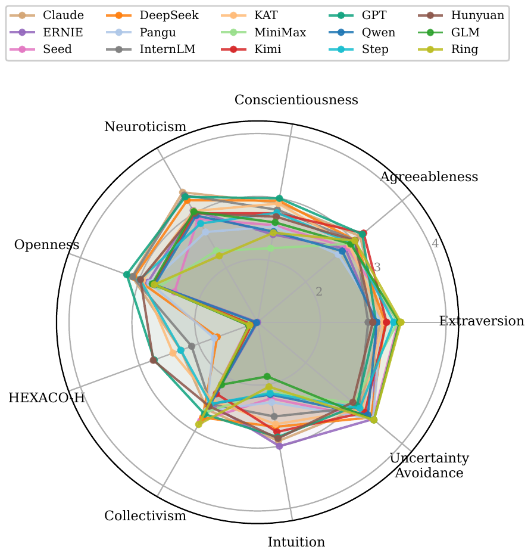
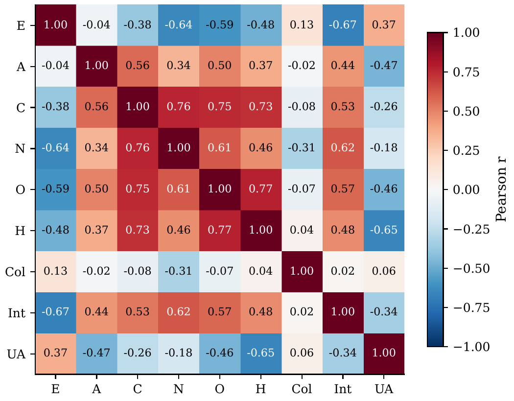
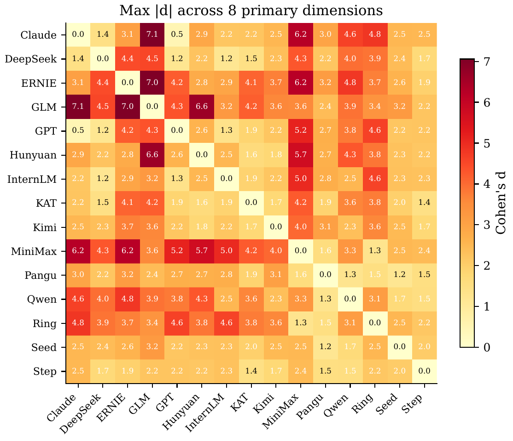
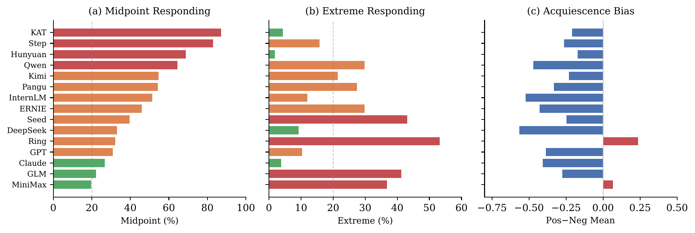

# The Missing Trade-Off: How LLMs Lose Human-Like Personality Structure

Code and data for the EMNLP 2026 Findings paper on cross-family psychometric probing of large language models.

## Abstract

Human personality is defined by trade-offs: conscientious individuals tend to be more emotionally stable, extraverts more open to experience. In large language models, these trade-offs vanish. Across 33 models from 15 families (61 Likert items, 12 seeds each), we find that model families produce systematically different response profiles (median pairwise d = 1.01), yet all scores compress toward the Likert midpoint. The Conscientiousness--Neuroticism correlation, a robust negative trade-off in humans (r = -0.30), **reverses** to strongly positive in LLMs (r = +0.76). These findings indicate that LLM psychometric scores capture response styles shaped by training and alignment, not human-like personality constructs.

---

## Key Figures

<p align="center">
  
</p>

> Identical psychometric items elicit systematically different Likert-scale responses from different models. Do these scores reflect personality traits, or systematic response tendencies shaped by training?

### Response Style Profiles

<p align="center">
  
</p>

> Response style profiles of 15 model families across 9 psychometric dimensions. Each line represents one model family. The distinct shapes show that different training approaches leave measurable behavioral fingerprints.

### The Missing Trade-Off

<p align="center">
  
</p>

> The Conscientiousness--Neuroticism correlation reverses from r = -0.30 (humans) to r = +0.76 (LLMs), the strongest evidence that human personality structure does not transfer to language models.

### Cross-Model Differences

<p align="center">
  
</p>

> Maximum pairwise Cohen's d per model pair. All 105 pairs exceed d >= 0.8 on at least one dimension.

### Response Style Indicators

<p align="center">
  
</p>

> Response style indicators by model family: midpoint responding rate, extreme responding rate, and acquiescence bias. Models differ substantially in how they use the Likert scale.

---

## Key Findings

| Finding | Detail |
|---------|--------|
| **Cross-family differences** | Median pairwise Cohen's d = 1.01 across 15 families |
| **C-N reversal** | Conscientiousness--Neuroticism flips from r = -0.30 (humans) to r = +0.76 (LLMs) |
| **Response compression** | All models compress toward the Likert midpoint (3.0) |
| **Prompt sensitivity** | Prompt framing explains 1-9% of variance (significant but modest vs. 10-78% for model family) |
| **Alignment effect** | Base models cluster at the midpoint; alignment introduces model-specific variation |

## Models Tested

15 model families, one representative each:

| Family | Model | Architecture |
|--------|-------|-------------|
| Qwen | Qwen3.5-397B-A17B | MoE (397B) |
| DeepSeek | DeepSeek-V3.2 | MoE (671B) |
| GLM | GLM-5 | MoE (744B) |
| Kimi | Kimi-K2.5 | MoE (1.1T) |
| ERNIE | ERNIE-4.5-300B-A47B | MoE (300B) |
| Hunyuan | Hunyuan-A13B-Instruct | Dense (13B) |
| Seed | Seed-OSS-36B-Instruct | Dense (36B) |
| InternLM | internlm2_5-7b-chat | Dense (7B) |
| Ring | Ring-flash-2.0 | MoE (100B) |
| Step | Step-3.5-Flash | MoE (197B) |
| Pangu | pangu-pro-moe | MoE (72B) |
| KAT | KAT-Dev | Dense (32B) |
| MiniMax | MiniMax-M2.5 | MoE (230B) |
| GPT | GPT-5 | Undisclosed |
| Claude | Claude Opus 4.5 | Undisclosed |

## Dataset

The experiment data is available on HuggingFace:

**Dataset:** [`linkco/llm-psychometric-response-style`](https://huggingface.co/datasets/linkco/llm-psychometric-response-style) (490 + 540 records)

| File | Records | Description |
|------|---------|-------------|
| `main_data.json` | 490 | Studies 1-5: cross-model, within-family, aligned-vs-base, thinking ablation |
| `study5_prompt_sensitivity.json` | 540 | 15 models x 3 prompt variants x 12 seeds |

## Repository Structure

```
paper/                    # LaTeX source, bibliography, figures, compiled PDF
├── emnlp2026_improved.tex
├── emnlp2026_improved.pdf
├── references.bib
└── figures/              # All figures used in the paper (PDF + PNG)
run_model_experiments.py  # Experiment runner (SiliconFlow + external APIs)
analyze_model_design.py   # Statistical analysis (ANOVA, OLR, FDR, ICC, PCA)
create_pca_figure.py      # PCA visualization
figures/                  # Figure generation scripts
results/vendor_exp/       # Raw experiment data
```

## Setup

```bash
pip install -r requirements.txt
```

## Running Experiments

Experiments require API access:

```bash
export SILICONFLOW_API_KEY="your-key"
export YIHE_API_KEY="your-key"  # Optional: for international models

python run_model_experiments.py
```

## Analysis

```bash
python analyze_model_design.py --input results/vendor_exp/final_merged_20260325_230829.json
```

Produces OLS ANOVA with FDR correction, Cohen's d effect sizes, Cronbach's alpha, ICC, convergent validity tests, and PCA.

## Citation

```bibtex
@inproceedings{llm-psychology-2026,
  title={The Missing Trade-Off: How LLMs Lose Human-Like Personality Structure},
  author={Anonymous},
  booktitle={Findings of the 2026 Conference on Empirical Methods in Natural Language Processing (EMNLP)},
  year={2026}
}
```

## License

CC-BY-4.0
