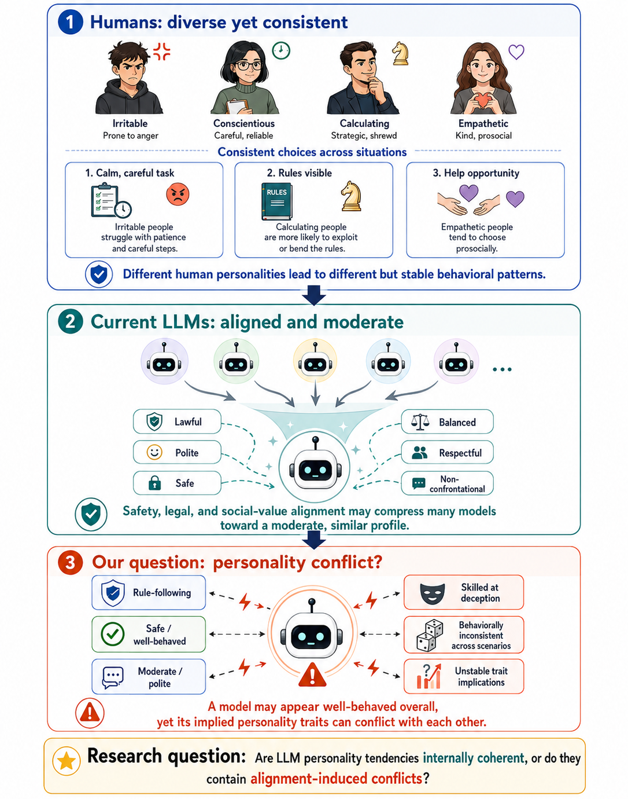
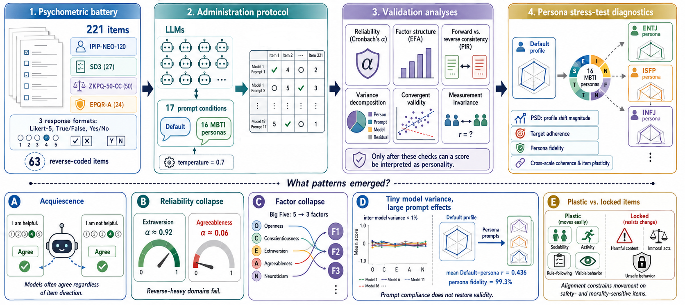
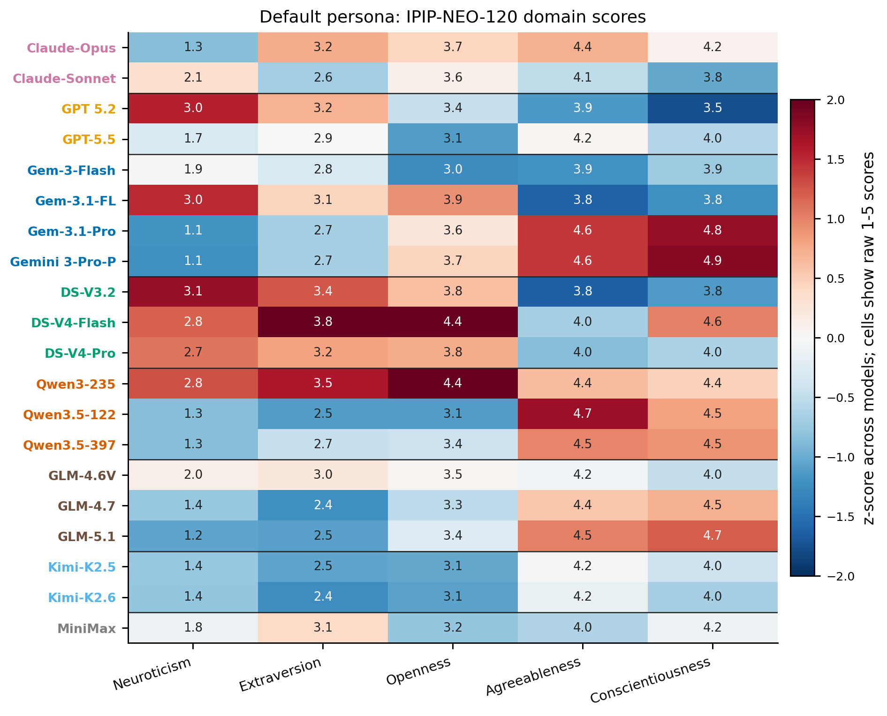
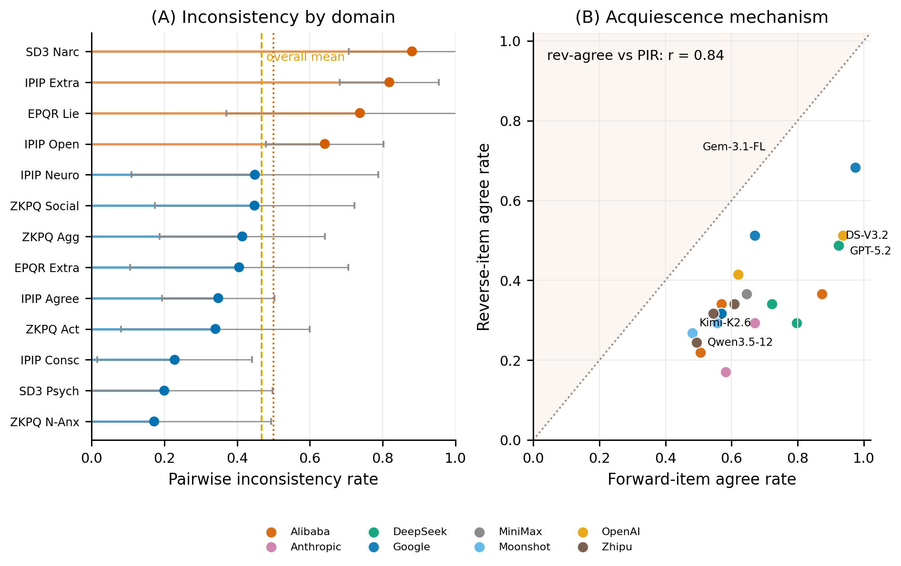
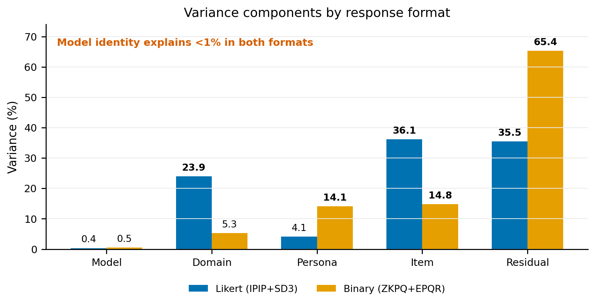
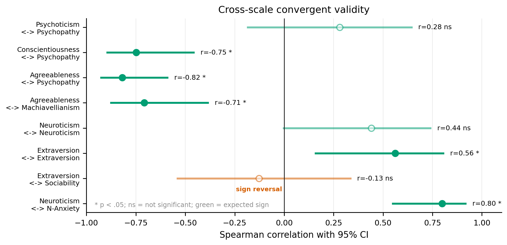
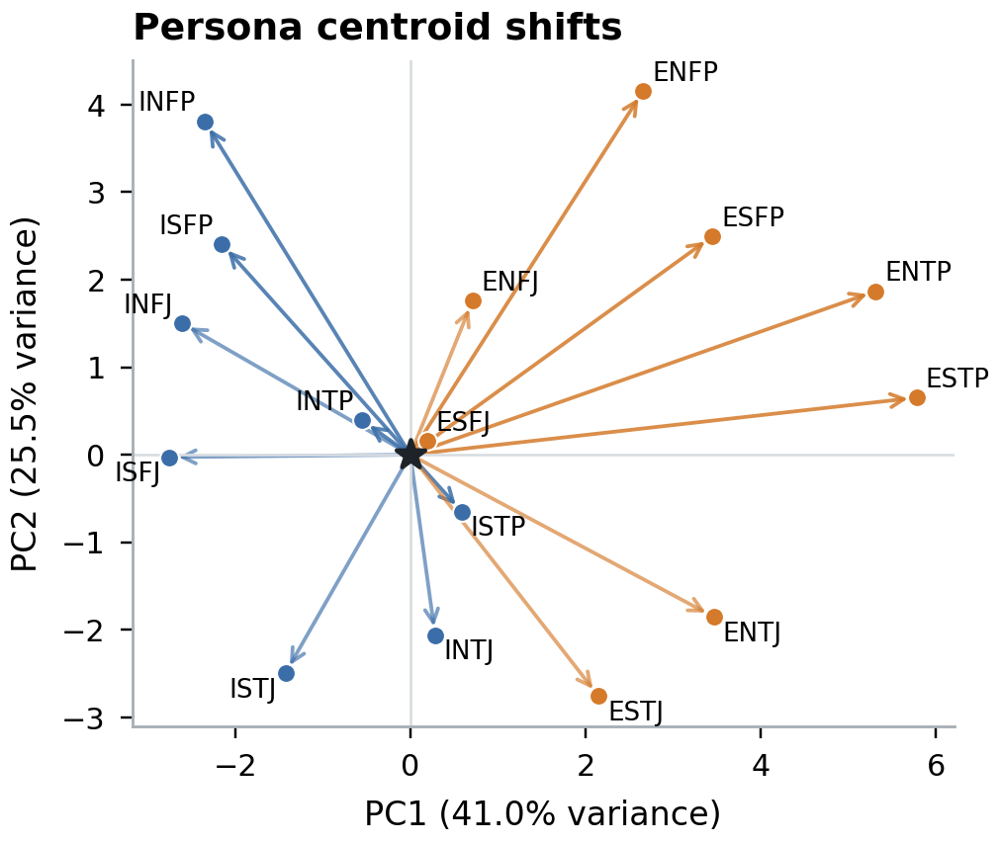
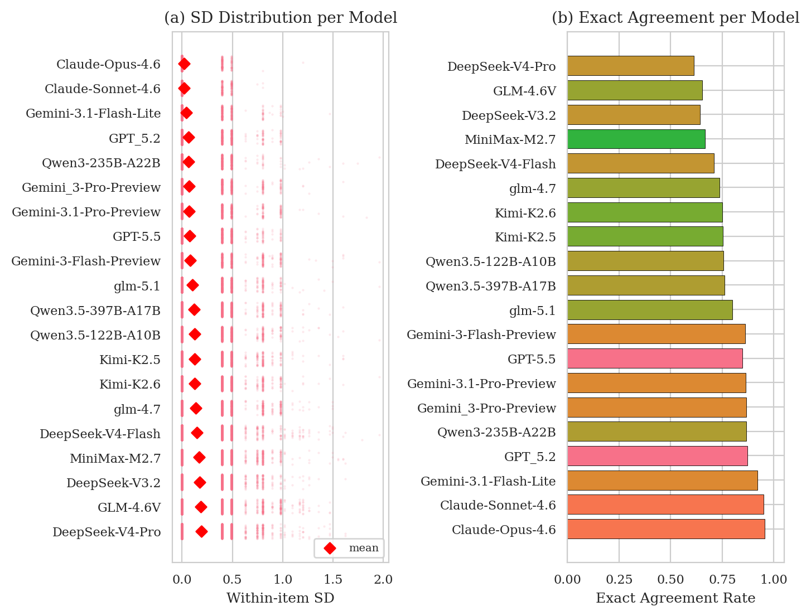

# When Psychometrics Meet LLMs: A Large-Scale Measurement Validity Study

**Do validated human personality instruments measure genuine traits in LLMs, or do the observed scores merely reflect response-style artifacts?**

This repository contains the complete data, analysis code, and paper for a psychometric validation study spanning **20 large language models** across **8 families**, administered **4 validated personality instruments** (221 items) under **17 persona conditions** (Default + 16 MBTI types), with **5 independent samples** per item-persona combination, yielding **375,700 total API calls**.

---

## Key Findings

1. **Acquiescence bias dominates.** Models agree with both forward- and reverse-keyed items, producing internally inconsistent personality profiles.

2. **Factor structure collapses.** Exploratory factor analysis recovers a single general factor rather than the expected Big Five structure.

3. **Response style, not trait.** Variance decomposition shows model identity and item-level effects explain far more variance than the putative personality domains.

4. **Persona prompting shifts profiles** but does not restore measurement validity. The shifts are stereotyped and convergent validity remains weak.

5. **Within-sample consistency varies widely.** Claude models show near-perfect consistency across repeated samples (SD ~ 0.02); DeepSeek-V4-Pro and GLM-4.6V are most variable (SD ~ 0.19).

---

## Overview

<p align="center">
  
</p>

<p align="center">
  
</p>

---

## Results Highlights

### Default Personality Profiles

All 20 models show an "agreeable, conscientious, emotionally stable" default profile under no persona instruction. The z-scored heatmap below shows that domain scores cluster tightly across models, with more variation between instruments than between model families.

<p align="center">
  
</p>

### Acquiescence Mechanism

Models agree with reverse-keyed items nearly as often as forward-keyed items. The forward-reverse gap (delta) is positive for IPIP (models agree with both directions) and negative for SD3, ZKPQ, and EPQR. This asymmetric acquiescence contaminates all downstream scoring.

<p align="center">
  
</p>

### Variance Decomposition

Less than 1% of total variance is explained by model identity. Item-level effects and residual variance dominate. The instruments are not measuring model-specific traits; they are measuring shared response tendencies shaped by alignment training.

<p align="center">
  
</p>

### Factor Structure Collapse

Exploratory factor analysis on IPIP-NEO-120 items recovers only 3 factors meeting the Kaiser criterion (eigenvalue > 1), compared to the expected 5-factor Big Five structure. Parallel analysis confirms that the first factor alone accounts for the majority of shared variance.

<p align="center">
  
</p>

### Persona Steering

MBTI persona prompts shift profiles by more than one SD from Default on average. Nearest-centroid classification recovers the prompted MBTI type in 319/320 cases (99.7%). However, cross-scale persona coherence is imperfect (0.839), and forward/reverse pairs move in the theoretically opposite direction only 70.4% of the time.

<p align="center">
  
</p>

### Within-Sample Consistency

Consistency varies dramatically across models. Claude models produce near-deterministic answers (exact agreement > 0.95), while DeepSeek-V4-Pro and GLM-4.6V show substantial spread (exact agreement ~ 0.61-0.65). Persona prompts do not degrade consistency; the Default condition is actually the least consistent.

<p align="center">
  
</p>

---

## Instruments

| Scale | Items | Format | Domains | Reverse Items | Source |
|-------|-------|--------|---------|---------------|--------|
| IPIP-NEO-120 | 120 | 5-point Likert | 5 domains x 6 facets | 41 | Johnson (2014) |
| SD3 (Short Dark Triad) | 27 | 5-point Likert | 3 | 5 | Jones & Paulhus (2014) |
| ZKPQ-50-CC | 50 | True/False | 5 | 12 | Aluja et al. (2006) |
| EPQR-A | 24 | Yes/No | 4 | 5 | Francis et al. (1992) |

**63 of 221 items (29%) are reverse-scored**, providing built-in consistency checks.

## Models (20 models, 8 families)

| Family | Models |
|--------|--------|
| Anthropic | Claude Opus 4.6, Claude Sonnet 4.6 |
| OpenAI | GPT-5.2, GPT-5.5 |
| Google | Gemini-3-Pro, Gemini-3-Flash, Gemini-3.1-Pro, Gemini-3.1-Flash-Lite |
| DeepSeek | DeepSeek-V3.2, DeepSeek-V4-Flash, DeepSeek-V4-Pro |
| Alibaba | Qwen3-235B-A22B, Qwen3.5-122B-A10B, Qwen3.5-397B-A17B |
| Zhipu | GLM-4.6V, GLM-4.7, GLM-5.1 |
| Moonshot | Kimi-K2.5, Kimi-K2.6 |
| MiniMax | MiniMax-M2.7 |

---

## Repository Structure

```
code/
  data/
    items_battery.json            # 221 items with scoring metadata
    exp_mbti_*.json               # Full response data per model (20 files)
    summary.csv                   # Aggregated scores: model x persona x scale x domain
  results/                        # Analysis output (56 CSV files)
    cronbach_alpha_by_domain.csv
    efa_eigenvalues.csv
    variance_decomposition.csv
    convergent_validity_enhanced.csv
    acquiescence_mechanism.csv
    wsc_by_model.csv
    ...
  run_mbti_experiment.py          # MBTI persona experiment runner
  postprocess_mbti.py             # Post-processing for experiment results
  build_battery.py                # Battery construction script
  BATTERY_SPECIFICATION.md        # Full scale documentation
  psychometric_analysis.py        # Core analysis: Cronbach alpha, EFA, PIR, SDR, variance
  generate_figures.py             # Main paper figures (fig3-fig6, heatmap, radar)
  polish_figures.py               # Figure style polishing
  within_sample_consistency.py    # Within-sample consistency analysis (fig_wsc1-9)
  cross_cutting_analysis.py       # Clustering, MBTI effects, within-family analysis
  persona_steering_analysis.py    # Persona fidelity, vector field, steering analysis
  round2_fixes.py                 # Acquiescence mechanism, item-level analysis
  round3_fixes.py                 # Human benchmarks, leave-one-out robustness
  round4_fixes.py                 # Synthetic baselines, persona leave-one-out

paper/
  figures/                        # All figures (PNG)
  paper.tex                       # Full paper (LaTeX)
  paper.pdf                       # Compiled paper
  refs.bib                        # Bibliography
  acl_natbib.bst                  # NATBIB style
  emnlp2021.sty                   # EMNLP 2021 style

requirements.txt
```

## Setup

```bash
pip install -r requirements.txt
```

## Reproducing Analyses

All scripts are in `code/` and use relative paths to `code/data/`, `code/results/`, and `paper/figures/`. Run in order:

```bash
cd code

# Step 1: Core psychometric analysis
python psychometric_analysis.py

# Step 2: Acquiescence mechanism, item-level analysis
python round2_fixes.py

# Step 3: Human benchmarks, robustness checks
python round3_fixes.py

# Step 4: Synthetic baselines, persona leave-one-out
python round4_fixes.py

# Step 5: Cross-cutting analyses (clustering, MBTI, within-family)
python cross_cutting_analysis.py

# Step 6: Persona steering analysis (fidelity, vector field)
python persona_steering_analysis.py

# Step 7: Within-sample consistency
python within_sample_consistency.py

# Step 8: Generate main paper figures
python generate_figures.py

# Step 9: Polish figure styles
python polish_figures.py
```

CSV results go to `code/results/`, figures go to `paper/figures/`.

## Compiling the Paper

```bash
cd paper
pdflatex paper.tex && bibtex paper && pdflatex paper.tex && pdflatex paper.tex
```

## Running New Experiments

```bash
export SILICONFLOW_API_KEY="your-key"
export YIHE_API_KEY="your-key"

cd code
python run_mbti_experiment.py
```

## Data Summary

- **375,700** raw API calls (20 models x 17 personas x 221 items x 5 samples)
- **61** refusals (< 0.02%), all under Default (no-persona) condition
- **17** domains across 4 instruments
- Temperature = 0.7 for all administrations

## Raw Data

The complete raw API responses (including model verbatim outputs, full prompts, and telemetry) are available on HuggingFace:

**[heihei/llm-psychology-raw-data](https://huggingface.co/datasets/heihei/llm-psychology-raw-data)**

The `code/data/` files in this repository contain scoring-only data (`parsed_value`, `scored_value`) with `raw_response`, `item_text`, `user_prompt`, `timestamp`, and `telemetry` fields stripped to keep file sizes under GitHub's 100MB limit. The HuggingFace dataset includes both the full raw versions (19 models) and the stripped GitHub versions (all 20 models).

## License

CC-BY-4.0
